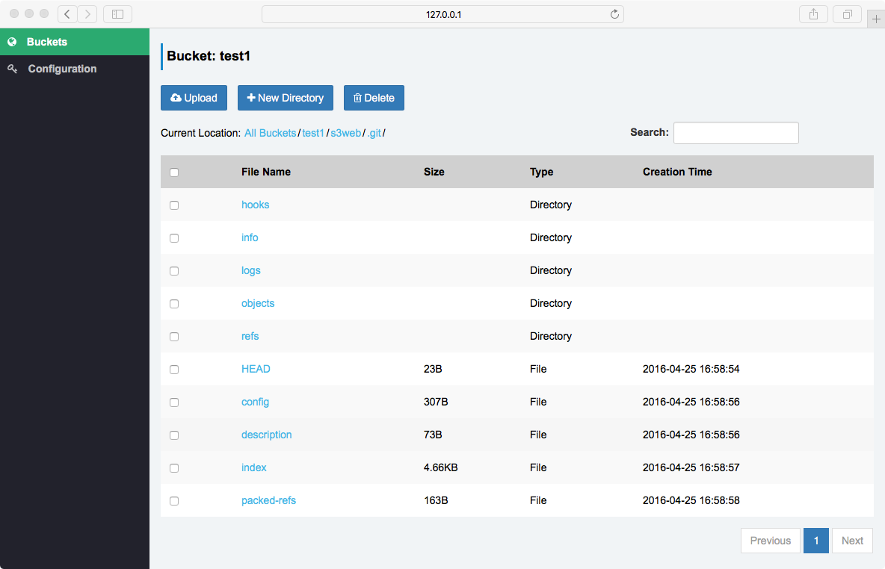
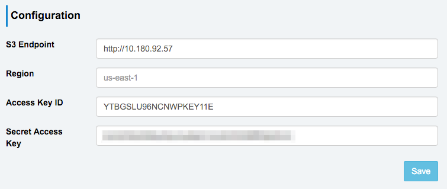

Sree
=========
**_S3 client for human beings_**



Sree enables you to easily manage your files through Amazon S3 protocol. Just configure your keys and you are good to go.

# Installation

```
> sudo pip install flask pycurl
> python app.py
```

Then open your favorate browser and visit http://127.0.0.1:5000

# Configuration



- S3 Endpoint: Defaults to Amazon's S3 service and surely you could use your own endpoint. If protocol part is ommitted, it defaults to `https`
- Region: The region you would use
- Access Key ID & Secret Access Key: Key and secret generated by service provider

Configurations are saved in your browser and not disclosed to anyone else.

# Technical Details

- In order to view your files in browser, Sree configures bucket CORS for you when creating buckets. See [Configuring CORS for an Amazon S3 Bucket](http://docs.aws.amazon.com/AWSJavaScriptSDK/guide/browser-configuring.html#Cross-Origin_Resource_Sharing__CORS_) for more details.
- Files uploaded via Sree are set as `public-read` as default so as to be downloadable. Future versions of Sree will make file ACLs configurable.

# Contributing

Contributions are welcome via pull requests and issues.

# License

Both [MIT](https://opensource.org/licenses/MIT) and [GPLv2](http://www.gnu.org/licenses/old-licenses/gpl-2.0.en.html)

# Authors

Can ZHANG(zhangcan@le.com)

Xingyi WU(wuxingyi@le.com)

Yuanying MA(mayuanying@le.com)